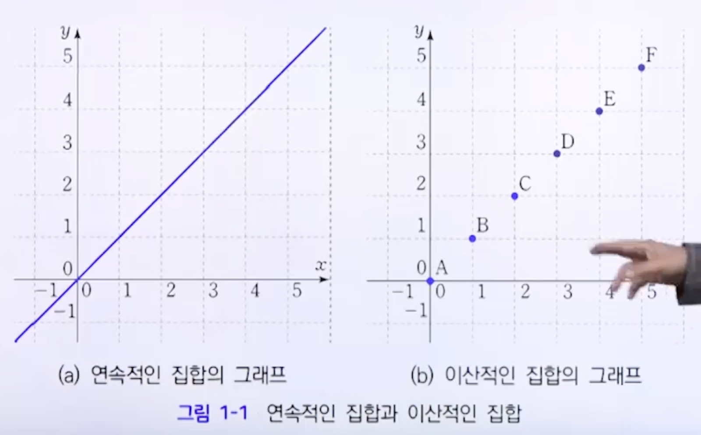
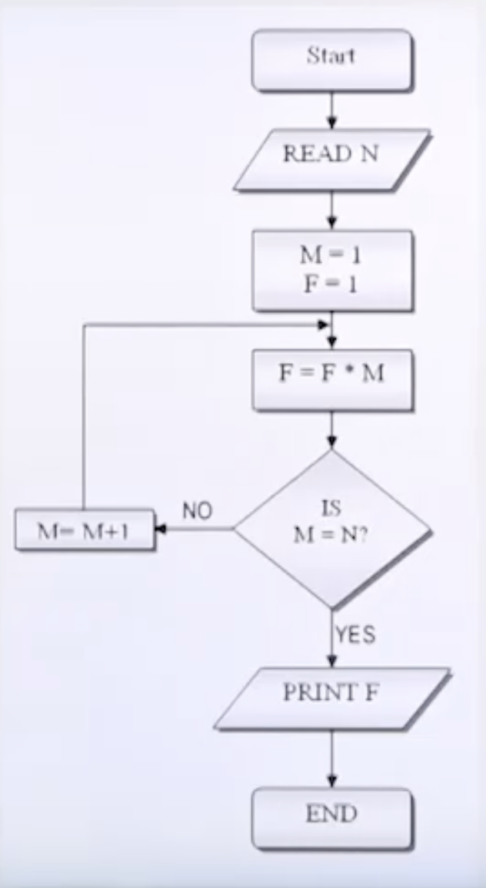

# 이산 수학이란

* 수학
  * 대수학
  * 해석학
  * 기하학

* 수학
  * 연속수학
  * 이산수학

## 도구, 기법, 방법론

축구

* 도구 : 축구공, 축구화, 축구장...
* 기법 : 킥, 해딩, 태클...
* 방법론 : 4-2-4, 4-3-3...

수학

* 도구 : 정의, 정리
* 기법 : 가우스 소거법, 근의 공식
* 방법론 : 상황에 따라 효과적이고 효율적인 도구와 기법을 선택하는 것 

프로그래밍

* 도구 : javascript, typescript, lodash
* 기법 : map, filter, reduce
* 방법론 : monad

## 추상화

abstract : 요약, 요지

abstraction

사전적 정의 : 일정한 인식 목표를 추구하기 위하여 여러 가지 표상이나 개념에서 특정한 특성이나 속성을 빼냄

> 문제와 관련된 핵심 내용만 남기고 관련없는 내용을 제거하여 문제를 단순화 시키는 과정

* *추상화* 한다. : 문제를 해결하기 위하여 꼭 필요한 것을 남기고 불필요 한 것을 배제시키는 것

## 알고리즘

algorithm

어떤 문제를 해결하기 위한 여러 동작들의 유한한 모임

### 알고리즘의 표현 방법

* computer programming language
  * 컴퓨터 작동을 위한 동작을 세밀하게 지시 => 알고리즘의 핵심 요소가 잘 드러나지 않음
  * 통일된 언어가 존재하지 않음 => 언어에 종속적임 
* 순서도 (flow chart)
  * 
  * 알고리즘의 작동 방법을 도식화 함
  * 내용이 복잡하거나 프로그램의 크기가 클 경우 도식화하기 어려움
* 의사코드 (pseudocode)
  * 모호한 부분을 프로그래밍 언어의 문법을 채용하여 명확하게 기술
  * 구체적으로 표현할 필요가 없는 부분은 자연어를 통해 설명문으로 기술
  * 알고리즘 작동방식을 설명하는 방법으로 사용 
